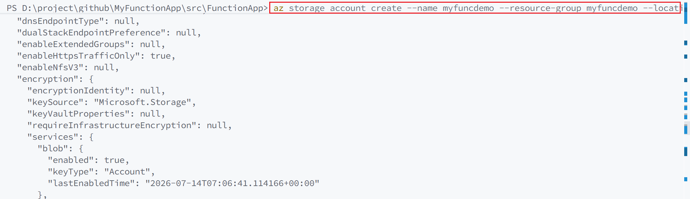
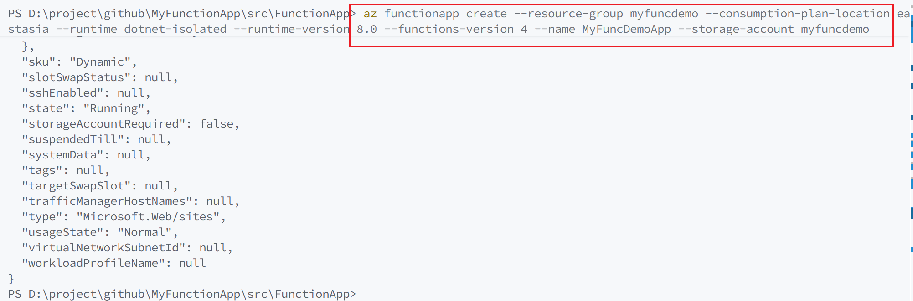
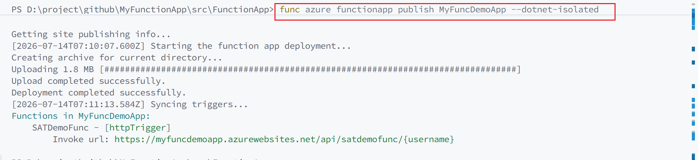
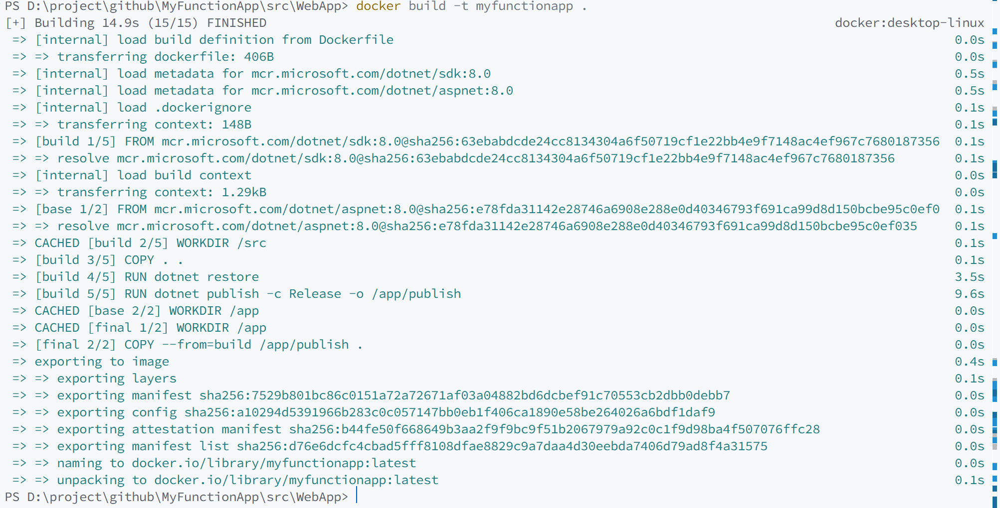

# Deploy

## Azure Function APP

### 1. create storage account
az storage account create --name myfuncdemo --resource-group myfuncdemo --location eastasia --sku Standard_LRS

  

### 2. create Function App
az functionapp create --resource-group myfuncdemo --consumption-plan-location eastasia --runtime dotnet-isolated --runtime-version 8.0 --functions-version 4 --name MyFuncDemoApp --storage-account myfuncdemo

  

### 3.deploy func
cd src/FunctionApp
func azure functionapp publish MyFuncDemoApp --dotnet-isolated

  

## Container

  
